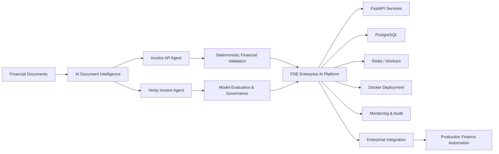
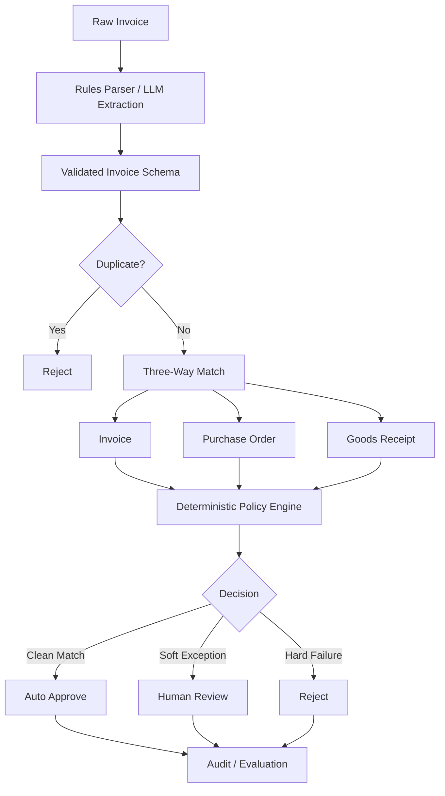
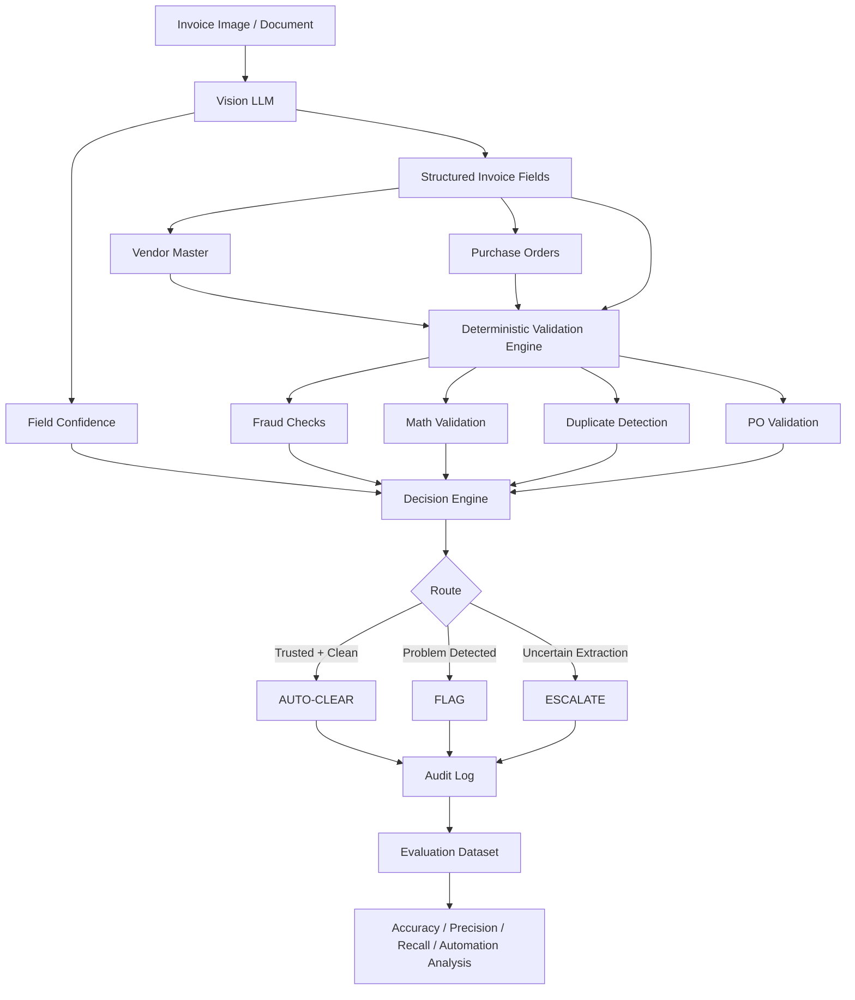
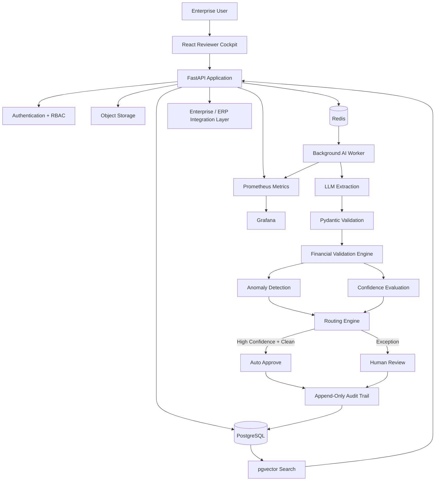
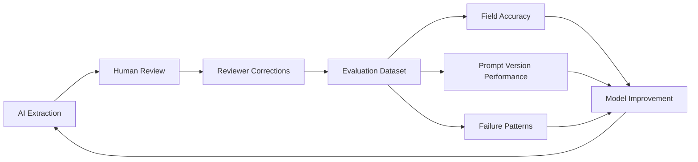
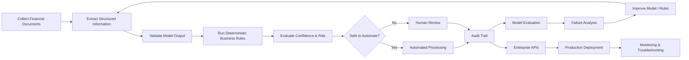

# AI Finance Automation & Forward Deployed Engineering Portfolio

<p align="center">
  <b>Applied AI • Document Intelligence • Model Evaluation • Enterprise Deployment • Financial Workflow Automation</b>
</p>

<p align="center">
  A three-project engineering portfolio focused on building, evaluating and deploying reliable AI systems for enterprise finance workflows.
</p>

---

## Overview

This portfolio explores how AI can automate financial document workflows without giving probabilistic models unrestricted control over high-risk financial decisions.

The projects progress from a focused Accounts Payable agent to an evaluation-driven autonomous invoice system and finally to a production-oriented enterprise AI platform.

The central engineering principle across the portfolio is:

> **Use AI where interpretation is required. Use deterministic software where correctness must be guaranteed.**

Together, the projects demonstrate experience across:

* Python
* LLM and Vision-Language Models
* Financial document intelligence
* Invoice extraction and classification
* Deterministic business-rule validation
* Model evaluation
* Accuracy, precision and recall analysis
* Human-in-the-loop workflows
* FastAPI
* REST APIs
* PostgreSQL
* Redis
* Docker
* Asynchronous workers
* Authentication and RBAC
* Observability
* Audit logging
* Production deployment patterns
* Enterprise AI integration

---

# Portfolio Architecture



### Portfolio progression

```text
PROJECT 01
AI extraction + deterministic financial decisions
                  ↓
PROJECT 02
Evaluation + confidence + exception management
                  ↓
PROJECT 03
APIs + database + queues + deployment + observability
                  ↓
ENTERPRISE AI FINANCE SYSTEM
```

---

# 01. Invoice AP Agent

### AI-Assisted Accounts Payable Decision Engine

**Python • LLM • Pydantic • Deterministic Rules • Three-Way Matching • Evaluation**

🔗 **Repository:**
https://github.com/gawandeshil03-ops/Invoice-AP-Agent

---

## Problem

Accounts Payable teams process large numbers of invoices containing unstructured information.

An LLM can extract information from messy invoices effectively, but allowing an AI model to independently decide whether money should be paid introduces unacceptable risk.

Financial decisions require:

* exact calculations
* predictable rules
* duplicate detection
* purchase-order validation
* auditability
* safe exception handling

---

## Solution

Invoice AP Agent separates **AI interpretation** from **financial decision logic**.

The AI component is responsible for converting unstructured invoice information into a structured schema.

Deterministic Python then handles:

* invoice validation
* duplicate detection
* invoice-to-PO matching
* goods-receipt matching
* quantity validation
* price variance checks
* financial arithmetic
* policy enforcement
* approval routing

The system produces one of three outcomes:

```text
AUTO-APPROVE
HOLD FOR REVIEW
REJECT
```

---

## Architecture



---

## Engineering Highlights

* Pluggable AI extraction layer
* Schema-validated model output
* Deterministic invoice/PO/receipt three-way matching
* Duplicate invoice detection
* Conservative approval policy
* Human-in-the-loop review
* Hard and soft exception separation
* Automated evaluation pipeline
* Safety gate preventing unsafe auto-approval
* Offline/default rules-based operation with optional model extraction

---

## Why It Matters

This project demonstrates an important production AI design pattern:

```text
LLM
↓
Interpret ambiguous information

Deterministic Software
↓
Make financially sensitive decisions
```

The model does not perform payment mathematics or independently authorize payments.

---

# 02. Verity Invoice Agent

### Evaluation-Driven Autonomous Accounts Payable Agent

**Python • Gemini Vision • Pydantic • Streamlit • Model Evaluation • Audit Logging**

🔗 **Repository:**
https://github.com/gawandeshil03-ops/Verity-Invoice-Agent

---

## Problem

Building an AI agent that appears accurate is not enough for a finance environment.

Before automation can safely increase, engineers need to understand:

* how accurately documents are extracted
* whether fraud scenarios are detected
* how many clean invoices can be automated
* when the model should escalate
* where failures occur
* how often incorrect decisions escape human review

---

## Solution

Verity treats **evaluation and trust** as core parts of the AI architecture.

The agent:

1. Reads invoice documents using a vision model.
2. Produces structured financial information.
3. Checks the invoice against vendor and PO records.
4. Runs deterministic financial and fraud checks.
5. Evaluates confidence and detected findings.
6. Routes the invoice appropriately.
7. Records every decision in an audit trail.

---

## Architecture



---

## Evaluation Framework

The system evaluates three fundamental questions.

### 1. Did the model read the document correctly?

Measured using extraction accuracy.

### 2. Did the system make the correct decision?

Measured using:

* routing accuracy
* fraud precision
* fraud recall

### 3. Can the automated decisions be trusted?

Measured using:

* automation rate
* escaped-error rate

---

## Example Evaluation Results

| Metric              | Result |
| ------------------- | -----: |
| Extraction Accuracy |   100% |
| Fraud Recall        |   100% |
| Fraud Precision     |  77.8% |
| Routing Accuracy    |    94% |
| Automation Rate     |    72% |
| Escaped-Error Rate  |   2.8% |

The evaluation also identifies an important failure pattern: degraded scans can produce overconfident model outputs.

That creates a concrete engineering improvement opportunity around independent image-quality and confidence calibration.

---

## Engineering Highlights

* Vision-based invoice extraction
* Structured-output validation
* Vendor-master verification
* PO validation
* Duplicate detection
* Bank-detail change detection
* Vendor impersonation detection
* Financial anomaly checks
* Confidence-aware routing
* Human exception workflow
* Append-only audit logging
* Batch evaluation
* Explicit failure analysis

---

# 03. FDE Enterprise AI Invoice Processing Platform

### Production-Oriented AI Deployment Platform for Enterprise Finance

**Python • FastAPI • PostgreSQL • Redis • OpenAI • pgvector • React • Docker • Prometheus • Grafana**

🔗 **Repository:**
https://github.com/gawandeshil03-ops/FDE-Enterprise-AI-Invoice-Processing-Platform

---

## Problem

An AI proof of concept is very different from an enterprise AI system.

Production deployment requires much more than a model.

A real system needs:

* secure document ingestion
* APIs
* authentication
* user permissions
* persistent storage
* background processing
* retries
* observability
* audit trails
* model monitoring
* human review
* deployment infrastructure
* failure recovery
* customer-specific configuration

---

## Solution

The FDE Enterprise AI Invoice Processing Platform expands the invoice-intelligence concept into a production-oriented architecture designed around enterprise deployment requirements.

The platform supports the complete lifecycle:

```text
Login
↓
Upload Invoice
↓
Secure Storage
↓
Queue Processing Job
↓
AI Extraction
↓
Business Validation
↓
Confidence / Anomaly Analysis
↓
Human Review or Auto Approval
↓
Audit Trail
↓
Monitoring
```

---

# Enterprise Architecture



---

## Backend Engineering

The platform contains a FastAPI-based backend with:

* invoice APIs
* health endpoints
* authentication
* bearer tokens
* tenant-aware data access
* role-based access control
* invoice status workflows
* processing-job endpoints
* review correction APIs
* approve/reject workflows
* audit-log APIs
* natural-language invoice search
* operational assistant capabilities

---

## Data Layer

PostgreSQL provides persistent storage for:

* invoices
* suppliers
* users
* organizations
* line items
* processing jobs
* validation results
* audit events
* extracted information

SQLAlchemy provides the ORM layer and Alembic handles schema migrations.

---

## Asynchronous Processing

AI processing is separated from request handling through a queued worker architecture.

```text
Invoice Upload
      ↓
Processing Job
      ↓
Redis Queue
      ↓
AI Worker
      ↓
Extraction
      ↓
Validation
      ↓
Database
```

The worker architecture supports:

* retries
* failed-job inspection
* manual reprocessing
* processing-duration tracking
* model-cost tracking
* structured error logging

---

## AI Extraction Layer

The AI layer supports structured invoice extraction using model APIs.

Engineering capabilities include:

* strict extraction schemas
* prompt-version tracking
* per-field confidence
* provider token accounting
* model-cost estimates
* development fallbacks
* model tiering
* retrieval-assisted extraction
* reusable invoice embeddings

---

## Retrieval & Similarity

The platform uses `pgvector` to store invoice embeddings.

This enables:

* similar-invoice search
* near-duplicate detection
* supplier-history retrieval
* contextual extraction
* anomaly investigation

---

## Financial Validation

Extracted information is not immediately trusted.

The platform applies deterministic validation rules before invoices progress through the workflow.

Examples include:

* field validation
* supplier checks
* amount validation
* duplicate detection
* confidence thresholds
* supplier amount outliers
* similar-document detection

---

## Human-in-the-Loop Review

Low-confidence or anomalous invoices are routed to a reviewer cockpit.

Reviewers can:

* inspect extracted information
* correct fields
* approve invoices
* reject invoices
* inspect processing failures
* trigger reprocessing
* inspect similar invoices
* review audit history

---

# Model Evaluation & Monitoring

Model performance is treated as an operational metric rather than a one-time experiment.

The platform can derive extraction accuracy from reviewer corrections and measure performance across prompt/model versions.



---

# Observability

Production AI requires visibility into both software and model behavior.

The platform includes operational metrics for:

* API request volume
* API latency
* Redis queue depth
* failed extraction jobs
* validation failures
* processing duration
* estimated AI cost
* auto-approval events
* field corrections

Prometheus-compatible metrics can be visualized through Grafana.

---

# Deployment

The platform is containerized using Docker and Docker Compose.

```bash
docker compose up -d --build
```

The deployment architecture supports separate services for:

```text
Frontend
Backend API
PostgreSQL
Redis
AI Worker
Monitoring
```

GitHub Actions provides automated testing and deployment-oriented CI checks.

---

# How the Three Projects Connect

These projects are intentionally complementary rather than three isolated applications.

| Engineering Area         | Invoice AP Agent |   Verity   | FDE Enterprise Platform |
| ------------------------ | :--------------: | :--------: | :---------------------: |
| Python                   |         ✅        |      ✅     |            ✅            |
| Invoice Intelligence     |         ✅        |      ✅     |            ✅            |
| LLM / Vision Model       |         ✅        |      ✅     |            ✅            |
| Structured Extraction    |         ✅        |      ✅     |            ✅            |
| Deterministic Validation |         ✅        |      ✅     |            ✅            |
| Three-Way Matching       |         ✅        |   Roadmap  |        Extendable       |
| Human Review             |         ✅        |      ✅     |            ✅            |
| Model Evaluation         |         ✅        |     ✅✅     |            ✅            |
| Precision / Recall       |                  |      ✅     |        Extendable       |
| Automation Metrics       |         ✅        |      ✅     |            ✅            |
| FastAPI                  |                  |            |            ✅            |
| REST APIs                |                  |            |            ✅            |
| PostgreSQL               |                  |            |            ✅            |
| Redis / Queue            |                  |            |            ✅            |
| Docker                   |  Project tooling |            |            ✅            |
| RBAC / Authentication    |                  |            |            ✅            |
| Audit Trail              |    Evaluation    |      ✅     |            ✅            |
| Observability            |     CI/Evals     | Evaluation |            ✅            |
| Enterprise Deployment    |                  |            |            ✅✅           |

---

# End-to-End Engineering Story

The portfolio demonstrates the complete lifecycle of an applied AI system.



---

# Forward Deployed Engineering Skills Demonstrated

These projects collectively demonstrate capabilities relevant to Forward Deployed Engineering and Applied AI roles.

### AI Engineering

* LLM integration
* Vision-language models
* structured extraction
* prompt engineering
* confidence handling
* model evaluation
* failure analysis
* retrieval-assisted AI workflows

### Software Engineering

* Python
* Pydantic
* FastAPI
* REST API design
* SQLAlchemy
* PostgreSQL
* Redis
* asynchronous processing
* testing
* Git and GitHub

### Deployment Engineering

* Docker
* Docker Compose
* CI pipelines
* environment configuration
* health checks
* migrations
* retries
* deployment runbooks
* production-readiness practices

### Enterprise Integration

* structured APIs
* tenant-aware architecture
* RBAC
* data mapping
* audit trails
* object storage
* integration-ready service architecture
* customer-specific workflow configuration patterns

### Model Operations

* extraction accuracy
* precision
* recall
* automation rate
* escaped-error rate
* confidence analysis
* error categorization
* prompt-version performance
* cost monitoring

---

# Finance Domain Coverage

The portfolio focuses primarily on Accounts Payable and invoice intelligence, including:

* invoice processing
* vendor validation
* purchase-order verification
* three-way matching
* fraud indicators
* duplicate invoices
* bank-account changes
* quantity discrepancies
* amount anomalies
* tax/total validation
* exception management
* auditability
* touchless invoice processing

The same architecture can be extended toward:

* Accounts Receivable
* bank reconciliation
* expense processing
* purchase-order automation
* tax-document processing
* month-end close workflows
* compliance automation

---

# Repository Links

### 01 — Invoice AP Agent

**AI extraction + deterministic financial decision engine**

https://github.com/gawandeshil03-ops/Invoice-AP-Agent

---

### 02 — Verity Invoice Agent

**Evaluation-driven autonomous invoice intelligence**

https://github.com/gawandeshil03-ops/Verity-Invoice-Agent

---

### 03 — FDE Enterprise AI Invoice Processing Platform

**Production-oriented AI deployment and enterprise integration platform**

https://github.com/gawandeshil03-ops/FDE-Enterprise-AI-Invoice-Processing-Platform

---

# Recommended Exploration Order

For recruiters and engineers reviewing this portfolio:

```text
1. Invoice AP Agent
   ↓
   Understand the core AI + deterministic decision architecture

2. Verity Invoice Agent
   ↓
   Review model evaluation, confidence and exception-management design

3. FDE Enterprise AI Invoice Processing Platform
   ↓
   Explore production APIs, deployment, data infrastructure,
   observability and enterprise architecture
```

---

# Key Engineering Principle

> **Reliable enterprise AI is not just about making a model smarter. It is about controlling where the model is allowed to make decisions, measuring when it fails, routing uncertainty safely, and surrounding it with production-grade software.**

This portfolio explores that principle across the full path from an AI prototype to an enterprise deployment architecture.

---

## Author

**Shil Gawande**

GitHub:
https://github.com/gawandeshil03-ops

Focus Areas:

`Applied AI` • `Forward Deployed Engineering` • `Python` • `LLMs` • `Document Intelligence` • `Enterprise AI` • `Financial Automation` • `AI Deployment`
